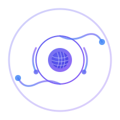

<p align="center">
  
</p>

<h1 align="center">Dhara</h1>

<p align="center">
  <strong>A minimal, secure, language-agnostic coding agent harness.</strong>
</p>

<p align="center">
  <a href="https://github.com/zosmaai/dhara/actions/workflows/ci.yml">
    
  </a>
  <a href="https://www.npmjs.com/package/@zosmaai/dhara">
    
  </a>
  <a href="https://www.npmjs.com/package/@zosmaai/dhara">
    
  </a>
  <a href="https://opensource.org/licenses/MIT">
    
  </a>
  <a href="https://nodejs.org">
    
  </a>
</p>

<p align="center">
  <a href="https://dhara.zosma.ai">📖 Docs</a>
  ·
  <a href="docs/getting-started.md">🚀 Getting Started</a>
  ·
  <a href="spec/roadmap.md">🗺️ Roadmap</a>
</p>

Dhara (धारा, "flow" in Sanskrit) is the engine that powers AI coding agents.
It provides the agent loop, tool management, session persistence, and extension
protocol — without being tied to any LLM provider, UI framework, or programming
language.

```bash
npx @zosmaai/dhara "List the files in this project"
```

## Features

- **🔄 Agent Loop** — LLM → tool → LLM cycle with streaming, cancellation, and error recovery
- **🔌 Extension Protocol** — JSON-RPC 2.0 wire protocol. Write extensions in any language
- **📦 20+ LLM Providers** — OpenAI, Anthropic, Google, Mistral, Groq, DeepSeek, Bedrock, and more via pi-ai
- **🛡️ Capability Sandbox** — Declare what tools need. Block everything else.
- **💾 Session Persistence** — Append-only JSONL format. Resume conversations across restarts.
- **🖥️ TUI + REPL** — Full-screen terminal UI with syntax highlighting, or line-based REPL
- **📝 Context Files** — AGENTS.md / CLAUDE.md auto-loading per project
- **🔧 Extensions** — Any language, any tool, any hook. Extensions are subprocesses, not function calls.

## Quick Start

```bash
# Run with a prompt (auto-detects opencode-go, or use --provider)
npx @zosmaai/dhara "List the files in this project"

# Interactive mode (TUI)
npx @zosmaai/dhara

# Choose a provider
export GOOGLE_API_KEY="..."
npx @zosmaai/dhara --provider google --model gemini-2.5-flash
```

## Providers

Dhara supports 20+ LLM providers through the [pi-ai](https://github.com/earendil-works/pi-mono) integration.
Set the corresponding environment variable and use `--provider`:

| Provider | Env Var | `--provider` |
|---|---|---|
| OpenAI | `OPENAI_API_KEY` | `openai` |
| Anthropic | `ANTHROPIC_API_KEY` | `anthropic` |
| Google Gemini | `GOOGLE_API_KEY` | `google` |
| Mistral | `MISTRAL_API_KEY` | `mistral` |
| Groq | `GROQ_API_KEY` | `groq` |
| DeepSeek | `DEEPSEEK_API_KEY` | `deepseek` |
| Amazon Bedrock | AWS credentials | `amazon-bedrock` |
| Azure OpenAI | `AZURE_OPENAI_API_KEY` | `azure-openai-responses` |
| Fireworks | `FIREWORKS_API_KEY` | `fireworks` |
| OpenRouter | `OPENROUTER_API_KEY` | `openrouter` |
| xAI | `XAI_API_KEY` | `xai` |
| Hugging Face | `HUGGINGFACE_API_KEY` | `huggingface` |
| Cloudflare | `CLOUDFLARE_API_KEY` | `cloudflare-workers-ai` |

Built-in providers (no pi-ai needed): `openai`, `anthropic`, `opencode-go`.

## Standard Tools

Dhara ships with 6 essential tools. Everything else is an extension.

| Tool | Description | Capability |
|---|---|---|
| `read` | Read file contents | `filesystem:read` |
| `write` | Create/overwrite files | `filesystem:write` |
| `edit` | Surgical text replacement | `filesystem:read`, `filesystem:write` |
| `ls` | Directory listing | `filesystem:read` |
| `grep` | Pattern search across files | `filesystem:read` |
| `bash` | Shell command execution | `process:spawn` |

Network tools (web fetch, web search), database tools, git operations — all belong in **extensions**.

## Extensions

Extensions communicate via **JSON-RPC 2.0 over stdin/stdout**. Any language works.

```python
# my-extension/main.py
import sys, json

for line in sys.stdin:
    req = json.loads(line)
    if req["method"] == "initialize":
        print(json.dumps({"jsonrpc":"2.0","result":{
            "protocolVersion":"0.1.0","name":"my-ext","version":"1.0.0",
            "tools":[{"name":"hello","description":"Say hello",
                      "parameters":{"type":"object","properties":{}}}]
        },"id":req["id"]}))
    elif req["method"] == "tools/execute":
        print(json.dumps({"jsonrpc":"2.0","result":{
            "content":[{"type":"text","text":"Hello from Python!"}]
        },"id":req["id"]}))
    sys.stdout.flush()
```

Install: copy to `~/.dhara/extensions/my-extension/` with a `manifest.json`.

## Documentation

Full documentation is at **[dhara.zosma.ai](https://dhara.zosma.ai)**.

- [Getting Started Guide](docs/getting-started.md)
- [Writing Your First Extension](docs/write-first-extension.md)
- [Architecture Overview](spec/architecture.md)
- [Extension Protocol Spec](spec/extension-protocol.md)
- [Session Format](spec/session-format.md)
- [Roadmap](spec/roadmap.md)

## Architecture

```
┌─────────────────────────────────────────┐
│              ECOSYSTEM LAYER            │
│  Packages · Themes · Skills · Prompts   │
├─────────────────────────────────────────┤
│              EXTENSION LAYER            │
│  Tools · Providers · Renderers · Hooks  │
│  (any language, wire protocol)          │
├─────────────────────────────────────────┤
│               CORE LAYER               │
│  Agent Loop · Tool Interface · Sandbox  │
│  Session Format · Event Bus             │
│  (< 2,000 lines, no LLM, no UI)         │
└─────────────────────────────────────────┘
```

## Project Status

Dhara is in active development. Phases 0–3 (Spec, Core, Standard Library, CLI) are
complete. Current work focuses on documentation, extension ecosystem, and launch prep.

See [spec/roadmap.md](spec/roadmap.md) for details.

## Contributing

See [CONTRIBUTING.md](CONTRIBUTING.md) for guidelines.

## License

MIT — see [LICENSE](LICENSE). Spec documents are CC-BY-4.0 — see [LICENSE-SPEC](LICENSE-SPEC.md).

Built with ❤️ by [Zosma AI](https://zosma.ai).
